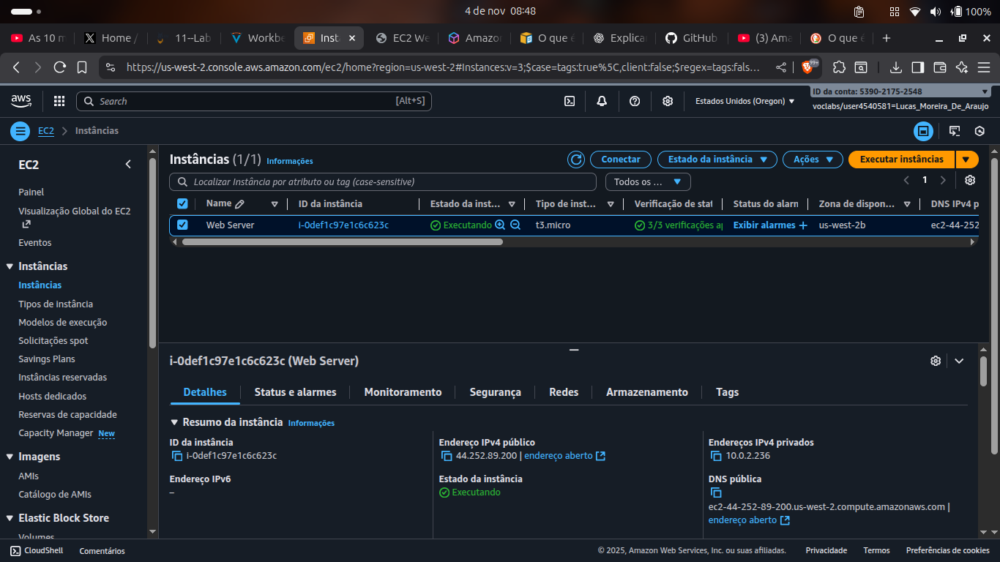
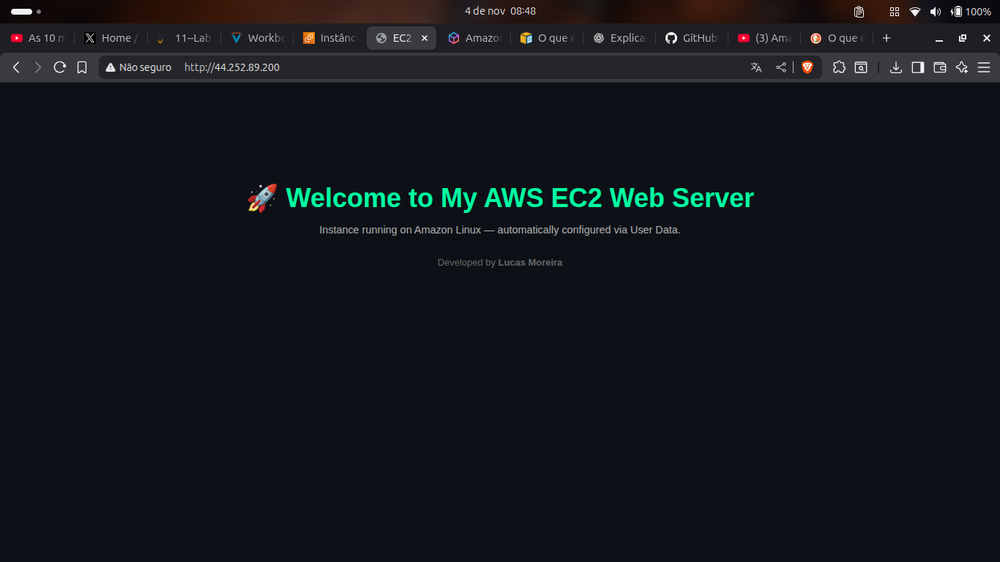
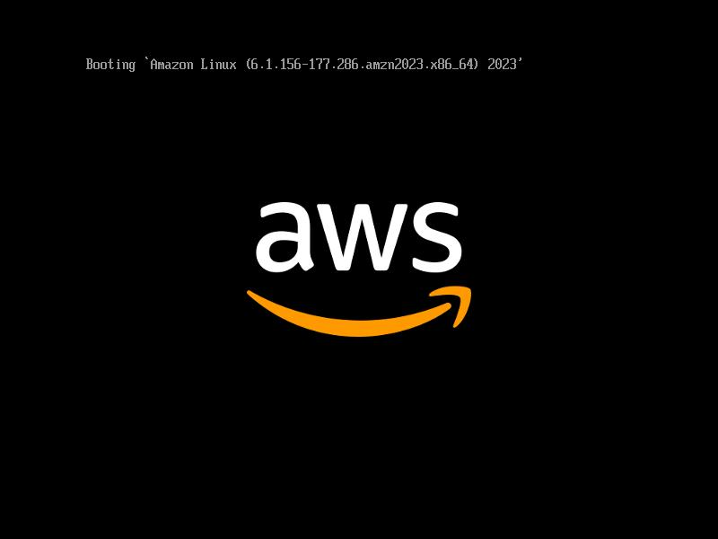

# AWS EC2 Lab - Deploy e Gestão de um Servidor Web

**Autor:** Lucas Moreira de Araujo
**Contexto:** Documentação da execução prática do laboratório "Introduction to Amazon EC2", com foco em segurança, automação e escalabilidade.

---

## Objetivo Principal

Este laboratório prático focou no deploy eficiente de um servidor web Apache (`httpd`) na nuvem, utilizando uma instância **Amazon EC2**. O objetivo foi ir além da simples inicialização, explorando *best practices* como automação via User Data, controle granular de tráfego via Security Group e gestão do ciclo de vida da instância (redimensionamento e proteção contra encerramento).

## Etapas e Destaques Técnicos

O projeto foi dividido nas seguintes fases, com aprendizados técnicos cruciais em cada uma:

### 1. Provisionamento e Automação Inicial

* **Instância Base:** Seleção da AMI **Amazon Linux 2023** e tipo de instância `t3.micro`.
* **User Data Script:** Utilizei o campo **User Data** para automatizar a configuração do servidor na primeira inicialização. Isso garante que a instância já suba pronta para servir conteúdo.
* **Resiliência (Proteção Contra Encerramento):** Ativei a `Termination Protection` na configuração avançada da instância como uma medida de segurança para ambientes de produção.

**Arquivo: user_data_script.sh (Código do User Data)**

```bash
#!/bin/bash
yum -y install httpd
systemctl enable httpd
systemctl start httpd
echo '<html><h1>Welcome to My AWS EC2 Web Server</h1><p>Instance running on Amazon Linux — automatically configured via User Data.</p><p>Developed by Lucas Moreira</p></html>' > /var/www/html/index.html
```

### 2. Controle de Acesso e Segurança

Inicialmente, o acesso via IP Público falhou. Isso demonstrou o papel fundamental do **Security Group** como um *stateful firewall*.

* **Ação:** Foi necessário editar as regras de entrada (Inbound Rules) do Security Group `Web Server security group`.
* **Regra Adicionada:** **Tipo:** HTTP | **Porta:** 80 | **Origem:** Custom (0.0.0.0/0 - Anywhere).

### 3. Redimensionamento de Recursos e Monitoramento

* **Gestão de Capacidade:** Para simular uma mudança de requisito, a instância foi **parada** (`stopped`) antes de mudar o tipo de `t3.micro` para **`t3.small`** e aumentar o volume EBS de 8 GiB para **10 GiB**. Isso reforça a diferença entre estados de instância.
* **Monitoramento:** Explorei as métricas de performance no painel Monitoring (CloudWatch) e utilizei a ferramenta Get Instance Screenshot para diagnóstico de *boot* e *troubleshooting*.

### 4. Ciclo de Vida e Segurança Reforçada

* **Teste da Proteção Contra Encerramento:** A tentativa inicial de encerrar (`terminate`) a instância falhou com uma mensagem de erro, provando a eficácia da `Termination Protection` antes de ser desativada para a exclusão final.

---

## 📸 Evidências do Lab

As imagens abaixo provam a execução das tarefas chave e o sucesso do deploy.

| Descrição | Screenshot |
| :--- | :--- |
| **1. Status da Instância:** `Web Server` em estado 'Executando' com IP Público. |  |
| **2. Acesso ao Servidor Web:** Sucesso após o deploy e correção do Security Group. |  |
| **3. Diagnóstico de Boot:** Tela capturada da instância (`Get Instance Screenshot`), usada para *troubleshooting* e monitoramento. |  |
| **4. Documentação:** Acesso ao guia de usuário da AWS EC2, parte do processo de pesquisa e aprendizado. |  |
